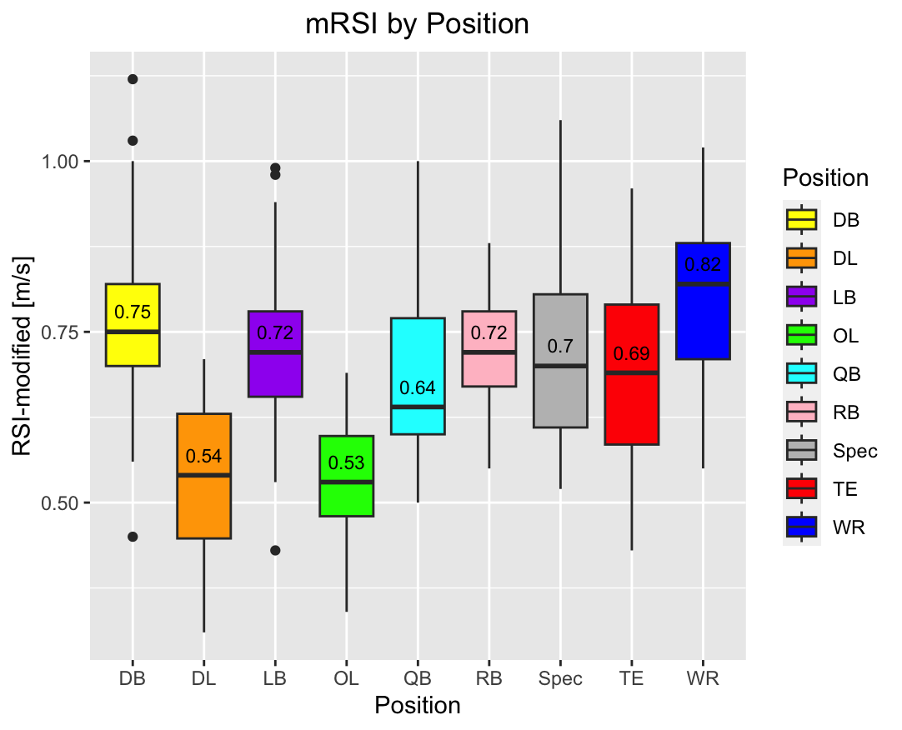
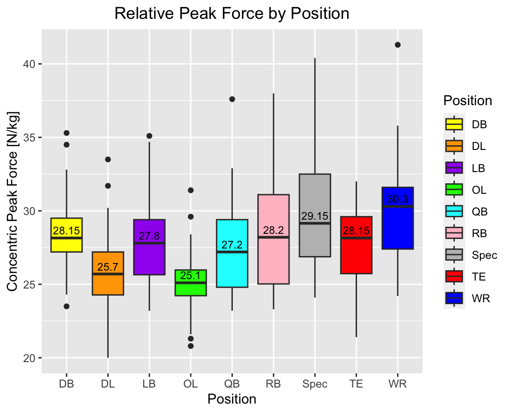
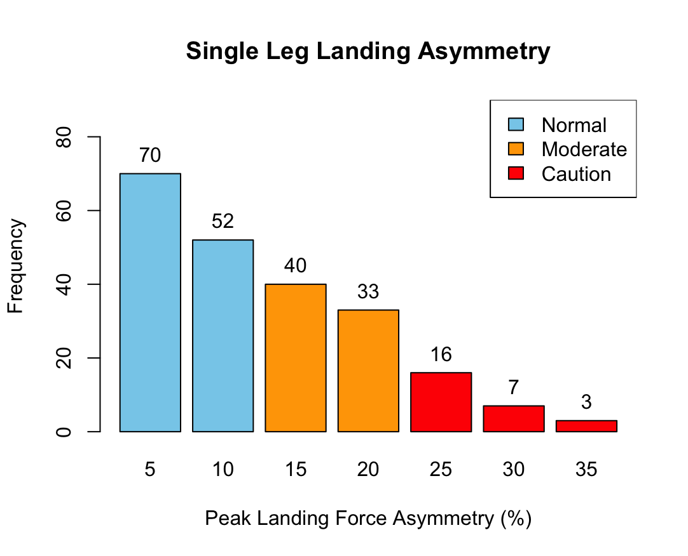

## Trevor Dean Abshire, M.S., CSCS, CPSS

My name is Trevor Abshire, I am an ex-collegiate athlete, currently serving as Assistant Director of Sport Performance and Lead Data Analyst at the University of California Davis. With a strong passion for leveraging data to drive performance and optimize training strategies, I strive to blend my background in athletics with my analytical skills to deliver impactful insights.

As an ex-collegiate athlete, I understand the importance of data-driven decision-making in improving athletic performance. My experience on the field and in the weight room have ignited a keen interest in exploring the vast potential of data analytics within the sports industry. Combining my expertise in strength and conditioning with my proficiency in data analytics, I aim to optimize training protocols, identify performance patterns, and provide valuable insights to athletes and coaches to increase longevity and win championships!

Throughout my career, I have successfully applied data analytics techniques to analyze and interpret complex datasets, enabling evidence-based decision-making. I possess a strong foundation in various analytical tools and programming languages, including R, SQL, Excel/Sheets, and Tableau, allowing me to extract actionable insights from diverse datasets and communicate them effectively to stakeholders.

With a commitment to continuous learning and professional growth, I have completed certifications in data science and data visualization, further strengthening my analytical skills and expanding my knowledge in the field.

In this portfolio, I showcase some of my projects, skills, and qualifications, demonstrating my ability to extract valuable insights from data and drive positive outcomes. I am excited to collaborate, share knowledge, and contribute to the field of data analytics in the context of sports and performance optimization.

Feel free to explore my portfolio and reach out for potential collaboration, discussion, or networking opportunities.

Projects
======================

### Project 1: Force Platform Position Analysis

- Objective: Analyze the performance and force production characteristics of starters from each position group using Vald ForceDecks force platforms.

#### [R Code](PositionBoxplot.R)

  
  

- Processed and cleaned a substantial dataset consisting of over 1000 data points, meticulously eliminating null values and detecting systematic outliers to ensure data integrity and quality
- Employed advanced R coding techniques to filter and segment the dataset based on position groups, enabling focused analysis and generating insightful visualizations tailored to specific groups
- Leveraged data analytics and statistical modeling in R to identify position groups that exhibited specific requirements for improved reactive and concentric strength, allowing for targeted training interventions and performance optimization strategies

### Project 2: Asymmetry Assessment and Flagging

- Objective: Develop a comprehensive assessment framework to evaluate asymmetries in the single leg jump test, considering peak landing force, and flag individuals at higher risk of injury, while providing strength and conditioning coaches a named list recommending potential exercise interventions for any athlete with a greater than 15% asymmetry in landing forces. 

- Employed rigorous data cleaning techniques on a dataset comprising over 1000 data points, ensuring data integrity and quality
- Leveraged my expertise in human kinematics and understanding of football to identify eccentric landing capabilities as a relevant metric for analysis
- Developed a comprehensive data visualization showcasing the frequency of tests exhibiting different levels of asymmetry, providing valuable insights into the performance characteristics of the athletes

## Statistical Software
  - R
  - SQL
  - Tableau
  - Excel/Sheets

## Performance Technologies
  - Vald ForceDecks
  - Vald ForceFrame
  - Hawkins Dynamics Force Platforms
  - EnodePro LPT
  - Catapult GPS
  - 1080 Sprint
  
## Skills
  - Data cleaning and preprocessing
  - Exploratory data analysis
  - Data visualization
  - Statistical analysis and modeling
  - Data storytelling
  
## Certifications
  - [Google Data Analytics Certificate](Trevor_Abshire_Google_Data_Analytics_Certificate.pdf)
  - [Certified Strength and Conditioning Specialist](https://certificates.nsca.com/1f2cf9a0-1e9b-4211-beef-dd1277cbf97e#gs.2a323g)
  - [Certified Performance and Sport Scientist](https://certificates.nsca.com/cefcc200-5bd9-4352-bad9-fb8e8677ef4e#gs.2a32yo)
    

## Contact Information
- [tdabshire@ucdavis.edu](tdabshire@ucdavis.edu)
- [Visit my LinkedIn profile](https://www.linkedin.com/in/trevorabshire/)
